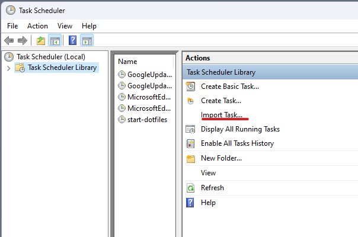
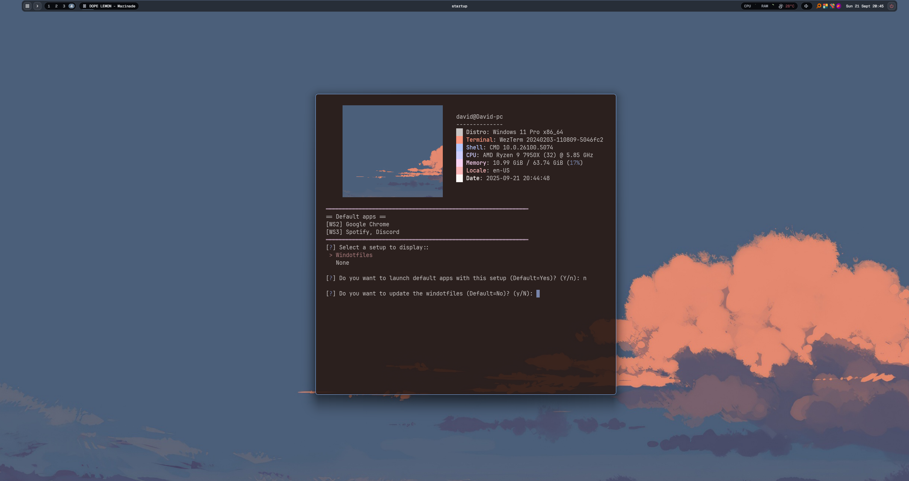

<div align="center">
  <h1>windotfiles</h1>
  
  
  
  
  
  
  <p></p>  

</div>

<div align="center">
  
  <p>
    <sub>
      Showcase of the windotfiles opening terminals, bottom and using update-winwal.
    </sub>
  </p>
</div>


# Table of Contents

- [Table of Contents](#table-of-contents)
- [Repository explanation](#repository-explanation)
- [Installation](#installation)
  - [1. Clone the repository](#1-clone-the-repository)
  - [2. WinGet](#2-winget)
  - [3. Install dependencies](#3-install-dependencies)
    - [Required dependencies](#required-dependencies)
    - [Optional dependencies](#optional-dependencies)
    - [WinGet dependencies](#winget-dependencies)
    - [Visual Code extensions](#visual-code-extensions)
    - [Run the script](#run-the-script)
  - [4. Configure the Task Scheduler](#4-configure-the-task-scheduler)
  - [5. Reboot the system](#5-reboot-the-system)
- [Usage](#usage)
  - [Update windotfiles](#update-windotfiles)
  - [Sym links](#sym-links)
  - [Flow Launcher](#flow-launcher)
  - [Startup launcher](#startup-launcher)
  - [Aliases](#aliases)
  - [Update the color scheme](#update-the-color-scheme)
- [Credits](#credits)

# Repository explanation
> [!WARNING]
 💀 Working in Windows is hard 💀

As you may know, at least for developers, Linux tends to be easier than Windows but Windows is the standard, at least for the videogames industry.\
Tired of setting up Windows again and again on different machines or fresh installs I have decided to create a permanent way of keeping my changes and my setup.

On top of that, I'm decided to speed up my productivity with a window tilling manager similar to i3 on Linux 🌟 `GlazeWM` 🌟 and some other cool features and automatizations.  

# Installation
In this section we will describe all the necessary steps to install the windotfiles 

## 1. Clone the repository
Using the following command to clone the repository with `PowerShell`
```shell
cd $env:USERPROFILE 
git clone --recurse-submodules https://github.com/Farravid/windotfiles.git
```

This will clone the repository and also recursively clone the submodules.
> [!WARNING]
If you don't clone the repository in the user's home directory, the setup won't work at all.\
Most of the setup depends on this.

## 2. WinGet
The only pre-requisite is to have the `WinGet` package manager operative. It should be available on the lastest Windows versions.

Nevertheless, and it is no surprise, `WinGet` could not work as expected with a fresh windows installation.\
If you end up having the blue stuck problem visit this issue: https://github.com/microsoft/winget-cli/issues/3832, specially the following code:
```
Invoke-WebRequest -Uri https://aka.ms/getwinget -OutFile winget.msixbundle
Add-AppPackage -ForceApplicationShutdown .\winget.msixbundle
del .\winget.msixbundle
```

## 3. Install dependencies
In order to fully install and use the windotfiles, you need to install some dependencies.\
Some dependencies are mandatory for a basic windotfiles installation but others are optional since they are just preferences.

For this reason, I have decided to split the dependencies in two parts.

### Required dependencies
These dependencies will be instaled when you run the installation script.
<details>
  <summary> ➡️ Click here to see the required dependencies</summary>
  
  
  * 🐍 `Python 3.11` ➡️ Python as main language for running scripts
  * 🐍 `pip install inquirer pyuac pypiwin32` ➡️ Libraries for installation scripts
  * 🐍 `pip install pywal colorz colorthief haishoku` ➡️ Libraries for changing the color scheme with winwal (pywal)
  * 🪟 `GlazeWM` ➡️ Windows Tiling Manager for Windows similar to i3
  *  ⌨️ `PowerShell 7` ➡️ Main shell
  *  ⌨️ `Windows Terminal` ➡️ Main terminal emulator
  *  ⌨️ `Oh My Posh` ➡️ Prompt theme engine for any shell
  *  🔠 `JetBrainsMonoNerdFont` ➡️ Windotfiles use this font
  * 🍃 `Flow Launcher` ➡️ Application launcher. Similar to Rofi
  *  🏬 `GitLFS` ➡️ Windotfiles use Git LFS
  * 🎨 `fastfetch` ➡️ This is just for style not gonna lie
  * 🧈 `Buttery Taskbar 2` ➡️ Allows to hide the taskbar forever (This is an .exe in the vendor's folder)
</details>


### Optional dependencies
After the required basic installation, the optional part of the script will kick in.\
You will have a prompt for each of the dependecies for choosing whether to install it or not.
<details>
  <summary> ➡️ Click here to see the optional dependencies</summary>
  
  ### WinGet dependencies
  
  * `Bottom` ➡️ A customizable graphical process/system monitor for the terminal.
  * `Spotify` ➡️ You know what this is
  * `Google Chrome` ➡️ Default windotfiles browser. (Alt + G will launch it)
  * `Github Desktop` ➡️ User interface for Github repositories
  * `Discord` ➡️ You know what this is
  * `Obsidian` ➡️ Software for taking notes and organize knowledge
  * `Neovim` ➡️ Terminal text editor 
  * `Everything` ➡️ Search engine for quickly finding files. (Alt + E will launch it)
  * `Visual Studio Code` ➡️ Text editor
  * `Visual Studio Community` ➡️ IDE
  * `Rust language` ➡️ Used for building the project for changing the Dygma color scheme.
  
  ### Visual Code extensions
  You may want to skip this whole section if you haven't installed Visual Studio Code on the previous step. 
  
  * `s-nlf-fh.glassit` ➡️ Add transparency to VSCode
  * `ms-vscode.cpptools` ➡️ Tools for C++ development
  * `naumovs.color-highlight` ➡️ Highlighter for colors
  * `donjayamanne.python-extension-pack` ➡️ Tools for Python development
  * `1YiB.rust-bundle` ➡️ Tools for Rust development
  * `dlasagno.wal-theme` ➡️ Tool for changing the VSCode color scheme based on winwal on runtime
  * `ms-vscode.powershell` ➡️ Tools for PowerShell development
  * `eamodio.gitlens` ➡️ Elevate Git with powerful tools
  * `wayou.vscode-todo-highlight` ➡️ Highlighter for TODO comments
  * `vscode-icons-team.vscode-icons` ➡️ Icons for VSCode
  * `TabNine.tabnine-vscode` ➡️ Powerful free AI Tool for VSCode. (Tests, Documentation, Chat)
  * `yzhang.markdown-all-in-one` ➡️ Tools for Markdown development
</details>

### Run the script
Go to the **windotfiles** folder and run the `install.bat` batch script as **ADMIN**
> [!WARNING]
You will get an **error** if you don't run the script as admin


## 4. Configure the Task Scheduler

The windotfiles repository includes a `tasks` directory that contains a XML file (`start-dotfiles.xml`) that must be used to configure the **Task Scheduler** to start the dotfiles automatically on log on.

This task is in charge of launching the [`Startup launcher`](#startup-launcher) and the `Buttery Taskbar 2`

> [!WARNING]
The task should be imported automatically when running the `install.bat` script.\
However, if you don't see the `start-dotfiles` task in your **Task Scheduler** you can import it manually.



## 5. Reboot the system

After completing the previous steps, restart the system to fully apply the changes.

# Usage
After the sucessful installation you can still modify the windotfiles for your specific cases or use some of the functionalities described below.

## Update windotfiles
If you have been using the windotfiles for some time you will notice some packages need upgrades.\
For this reason, I've created a powershell command available to make this process straight-away.
```shell
update-windotfiles
```
You only need to run this command on your powershell to run through the update of all the windotfiles packages you have installed.\
It will update the required and the optional packages you have installed as well as the VSCode extensions you decided to install.

## Sym links

> [!NOTE]
A sym link is a way to link one file to an additional folder location. This way you only need to modify one but the changes will be reflected in both. 

Every config file of this repository is symlinked to the original config file when running the `install.bat` script.\
This way, you can modify the files from the repository and the changes will be reflected in the actual programs, without the need of copying them manually.

## Flow Launcher
TODO
> [!WARNING]
Make sure to close Flow Launcher entirely before copying the windotfiles settings to the computer installation

## Startup launcher
This python script (`startup.py`) will be launched from the `Task Scheduler` every time you log in. It is in charge of launching `GlazeWM` and prompting the user with a setup selector.

Once the user has selected the setup and the default apps, that setup will be launched.

The default configuration is my usual configuration and my usual setups but you can feel free of changing it in order to match your purposes and setups.

<details>
  <summary> ➡️ Click here to see a screenshot of the startup launcher</summary>

  

</details>

> [!NOTE]
Make sure to disable all the relevant programs from windows start up in order to have a perfect experience

## Aliases
The `PowerShell` profile available in the `pwsh` contains some useful aliases that you can use or modify. Some of theme:
```shell
# Move and show the windotfiles folder
function windotfiles {Set-Location -Path $env:USERPROFILE\windotfiles && Get-ChildItem -Force }

# Open the windotfiles folder in Visual Studio Code
function cwindotfiles { code $env:USERPROFILE\windotfiles }

# Move and show the downloads folder
function down {Set-Location -Path $env:USERPROFILE\Downloads && Get-ChildItem -Force }

# Move and show the documents folder
function doc {Set-Location -Path $env:USERPROFILE\Documents && Get-ChildItem -Force }
```   

## Update the color scheme
In top of winwal, we have an `update-winwal` powershell command available for updating the color scheme based on the given wallpaper.\
This command, for now, supports updating the color scheme of the following software:
- `Windows Terminal`
- `GlazeWM`
- `VSCode` (`dlasagno.wal-theme` plugin must be installed)
- `Dygma Keyboard`

In order to use it, run the following command:
```shell
# Usage: update-winwal PathToWallpaper
# windotfiles
update-winwal .\assets\dunes.png
```

# Credits
- [`GlazeWM`](https://github.com/glzr-io/glazewm)
- [`Winwal`](https://github.com/scaryrawr/winwal)
- [`Buttery Taskbar 2`](https://github.com/LuisThiamNye/ButteryTaskbar2)
- [`Dygma Rust API`](https://github.com/mbwilding/dygma-focus-api-rs)
- [`Oh My Posh`](https://ohmyposh.dev/)
- [`Flow Launcher`](https://www.flowlauncher.com/)
