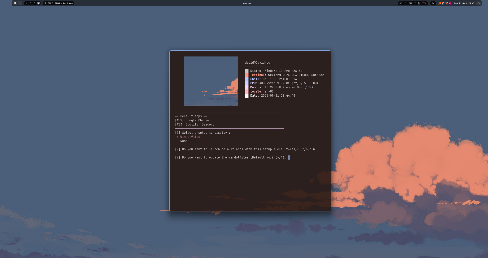

<div align="center">
  <h1>windotfiles</h1>
  
  
  
  
  
  
  <p></p>  

</div>

<div align="center">
  
  <p>
    <sub>
      Showcase of the windotfiles opening terminals, bottom and using update-winwal.
    </sub>
  </p>
</div>

# Table of Contents
- [Repository explanation](#repository-explanation)
- [Installation](#installation)
  - [Troubleshooting](#troubleshooting)
- [Usage](#usage)
  - [Startup launcher](#startup-launcher)
  - [Update the color scheme](#update-the-color-scheme)
- [Credits](#credits)

# Repository explanation
> [!WARNING]
 💀 Working in Windows is hard 💀

As you may know, at least for developers, Linux tends to be easier than Windows but Windows is the standard, at least for the videogames industry.\
Tired of setting up Windows again and again on different machines or fresh installs I have decided to create a permanent way of keeping my changes and my setup.

On top of that, I'm decided to speed up my productivity with a window tilling manager similar to i3 on Linux 🌟 `GlazeWM` 🌟 and some other cool features and automatizations.  

# Installation
From a `PowerShell` terminal:

```shell
winget install Python.Python.3.13 Git.Git
```

Then, in a **new** terminal (so `python` and `git` are on PATH):

```shell
cd $env:USERPROFILE
git clone https://github.com/Farravid/windotfiles.git
python windotfiles\scripts\install.py
```

Reboot when the script finishes, and that's it.

The script handles everything else: git submodules, PowerShell 7, all required
programs (see `REQUIRED_WINGET_PROGRAMS` in `scripts/common.py`), config symlinks,
the pywal color pipeline, optional programs (it asks one by one), and the
`Start windotfiles` logon task in the **Task Scheduler** that launches the
[`Startup launcher`](#startup-launcher) on log on.

> [!WARNING]
The repository must live in the user's home directory (`%USERPROFILE%\windotfiles`),
otherwise the setup won't work at all. Python should be installed from winget, not
from the Microsoft Store.

> [!WARNING]
> Creating symlinks on Windows needs **Developer Mode** enabled
> (`Settings > Privacy & security > For developers > Developer Mode = On`).
> The installer checks for this and tells you if it's missing. No admin required.

## Troubleshooting
`WinGet` may not work as expected on a fresh Windows installation.\
If you end up having the blue stuck problem visit this issue: https://github.com/microsoft/winget-cli/issues/3832, specially the following code:
```
Invoke-WebRequest -Uri https://aka.ms/getwinget -OutFile winget.msixbundle
Add-AppPackage -ForceApplicationShutdown .\winget.msixbundle
del .\winget.msixbundle
```

# Usage
After the successful installation, you can still modify the windotfiles for your specific cases or use some of the functionalities described below.

## Startup launcher
This python script (`startup.py`) will be launched from the `Task Scheduler` every time you log in. It is in charge of launching `GlazeWM` and prompting the user with a setup selector.

Once the user has selected the setup and the default apps, that setup will be launched.

The default configuration is the basic configuration and but you can feel free of changing it in order to match your purposes and setups.



> [!NOTE]
Make sure to disable all the relevant programs from windows start up in order to have a perfect experience

## Update the color scheme
In top of winwal, we have an `update-winwal` powershell command available for updating the color scheme based on the given wallpaper.\
This command, for now, supports updating the color scheme of the following software:
- `Wezterm`

# Credits
- [`GlazeWM`](https://github.com/glzr-io/glazewm)
- [`Winwal`](https://github.com/scaryrawr/winwal)
- [`Buttery Taskbar 2`](https://github.com/LuisThiamNye/ButteryTaskbar2)
- [`Oh My Posh`](https://ohmyposh.dev/)
- [`Flow Launcher`](https://www.flowlauncher.com/)
